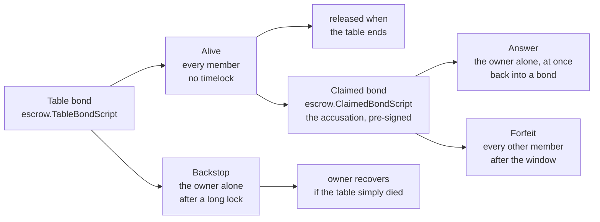
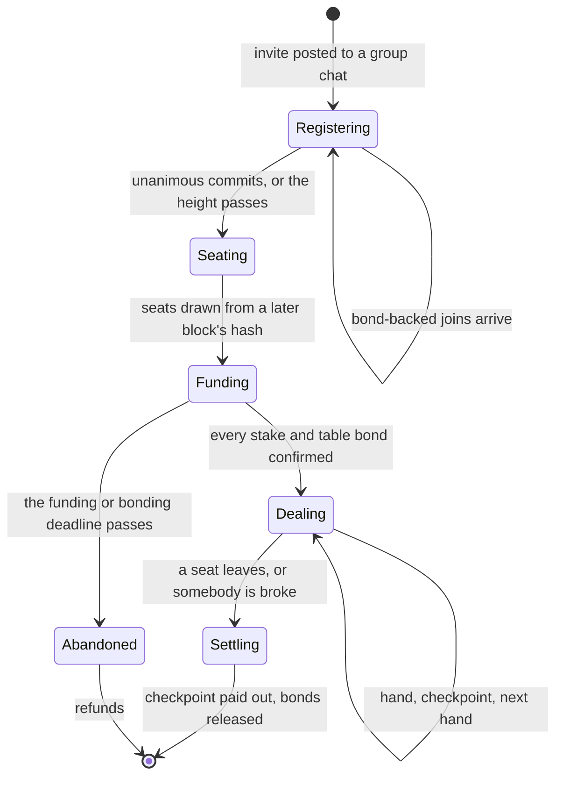
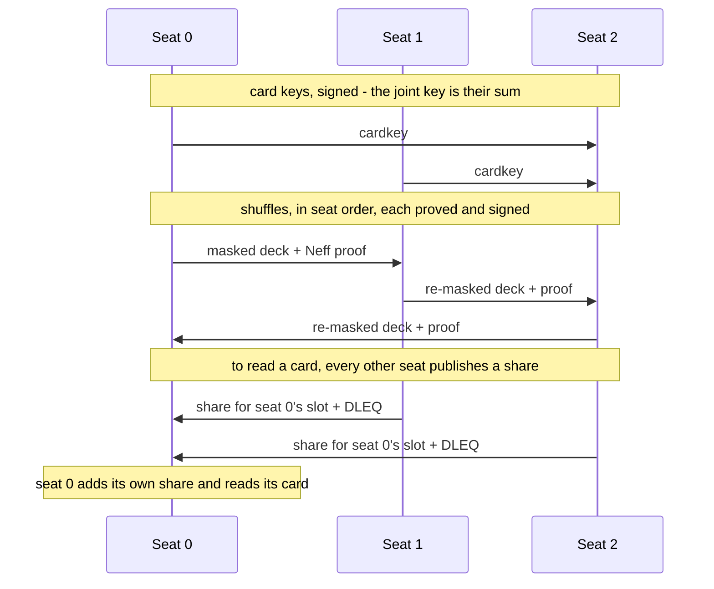
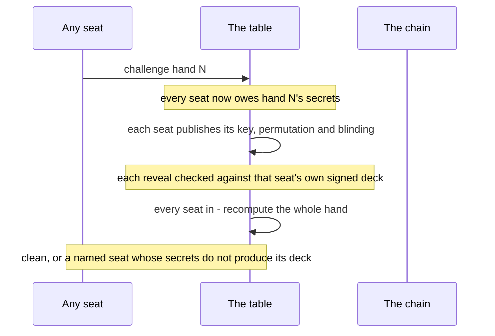
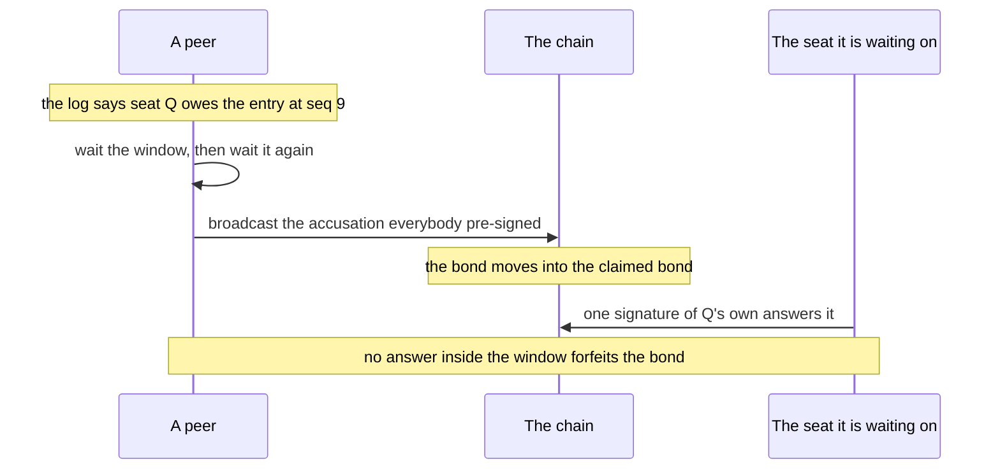

# Trust Model

What you have to trust to sit at one of these tables, what you do not, and where
the gaps still are.

Two rules for reading it. **The code is authoritative** - where this document and
the code disagree, the code is right and this is stale; the reasoning behind each
decision lives in the package comments and commit messages, which are long on
purpose. And **the numbers are named, not written out**: constants are referred to
by name (`escrow.MinBondBlocks`, `schema.Version`) because a document that repeats
a number is a document that will contradict the code within a month.

Scope: all of it. There is one implementation in this repository and it is the one
described here - no server, no referee, no party with a seat at the table that is
not a player.

---

## 1. The trust boundary

A player trusts their own machine, the Decred chain, and arithmetic. That is the
whole list.

```mermaid
flowchart TB
    subgraph trusted["Trusted"]
        own["Your own client<br/>(derives every script itself)"]
        chain["The Decred chain<br/>(what actually happened)"]
        math["Signatures and proofs<br/>(checked, never believed)"]
    end

    subgraph untrusted["Not trusted - cannot steal, can only stall"]
        peers["The other players"]
        gc["The Bison Relay group chat<br/>(a pipe with no memory)"]
        host["The dcrpulse host<br/>(chain + relay access)"]
    end

    subgraph absent["Absent by construction"]
        referee["No referee, dealer-of-record,<br/>server, or quorum"]
    end

    peers -->|"signed frames"| own
    gc -->|"delivers bytes,<br/>says who sent them"| own
    host -->|"asks the chain,<br/>carries messages"| own
    own --> chain
```



Three things follow, and they are the design in one breath each.

**Nobody can move your coin.** Every escrow's spending branch needs a signature
from every seat at the table; the only unilateral branch is your own refund, after
a timelock. There is no key anywhere that spends another player's stake.

**Nobody can read a card they are not entitled to.** The deck is masked to a joint
key that is the sum of every seat's, so opening any card needs a share from every
seat. No threshold, no t-of-n, nothing special about the board.

**Nobody can rewrite what happened.** Every action is signed by the seat that took
it and hash-chained, and the nonce is derived from the *position* rather than the
message - so signing two different things at one position publishes the signing
key. Equivocation is not reported and adjudicated; it hands the cheat's key to
whoever it lied to.

What the untrusted parties *can* do is stop. A peer that goes silent, or a group
chat that drops a message, can stall a table. That is the residual failure mode
throughout, and sections 5 and 6 are about paying for it rather than pretending it
away.

---

## 2. The money

Three instruments, each answering a different question. They are separate because
the times at which they can exist are different, and nothing dissolves that: see
the two bonds below.

| | what it is | who can spend it | when |
|---|---|---|---|
| **Stake** | the buy-in, in a per-seat n-of-n escrow | all seats together, or you alone after CSV | the hand |
| **Registration bond** | your own coin, timelocked | you, and only you, ever | `escrow.MinBondBlocks` |
| **Table bond** | forfeitable to the seats who stayed | see the branches below | `escrow.TableBondBlocks` |

### The stake escrow

Two branches. Settlement takes one `OP_CHECKSIGALTVERIFY` per member in canonical
key order, schnorr-secp256k1; refund is `csvBlocks OP_CHECKSEQUENCEVERIFY OP_DROP`
and then the depositor's own key, alone.

That asymmetry is deliberate and load-bearing: recovering *your own* funds must
never depend on anyone else's cooperation, and spending the pot must always depend
on everyone's. It is a chain of checks rather than a multisig opcode because the
escrow has to be Schnorr - Decred has `OP_CHECKMULTISIG` but no
`OP_CHECKMULTISIGALT`, and dcrd's secp256k1 ships no MuSig2 to aggregate with.

`pkg/escrow` is the only definition of these scripts. Every peer derives every
other peer's deposit address itself, from the roster it already agreed, so nobody
is ever *handed* an address. The check is not passed, it is removed - along with
the party that could have got it wrong. What replaces it is the requirement that
two implementations produce byte-identical scripts, since a one-byte disagreement
sends money where nobody can reach it.

One detail that is easy to get wrong and fails silently: **a signature is 65 bytes
on the wire**, not 64 - schnorr's 64 plus a sighash-type byte (`escrow.SigLen`).
Anything counting signatures in these sigScripts, including a co-signing host that
only relays them, must agree on that number, or it refuses every settlement this
design produces and cannot say why.

### The bonds, and why there are two

A forfeitable bond has to name the people it would be forfeited to. At
registration there is no roster to name - that is the whole reason funding is
roster-first - and the only party known that early would be a referee, which is
exactly the custody this design removes. **Forfeiture and registration time are
mutually exclusive**, so there are two instruments.

The registration bond is a Sybil cost and nothing else: your own coin, locked,
spendable by nobody, ever. It buys the cost of a fresh identity (keys are free;
a week of locked coin is not) and a standing deterrent against
register-and-vanish. It must be **proved held, not merely cited** - `pkg/escrow/pop.go`
has the holder sign a digest binding the outpoint to the key that will sit at the
table, and `VerifyBondPoP` takes the owner key from the *script* rather than from
the claimant, so a proof cannot be lifted from someone who published one.

The table bond is the one with teeth, posted after the roster closes and
derived from the settled seating:



**An answer beats an accusation because the window is the accusation's own.** An
accusation does not take the bond; it moves it into the claimed bond, whose delay
is `OP_CHECKSEQUENCEVERIFY` on the output the accusation itself creates, so the
window opens when the accusation confirms. Inside it only the owner can spend,
with one signature; the accusers can spend only after it closes. The accused need
not be believed, or heard, or fast - only still there.

The bond script has no branch the other members can take alone. Such a branch
would sit behind a lock counting from the bond output, confirmed before the table
deals and long satisfied by the time anybody abandons, so the others could take
the bond at a moment of their choosing with no window at all. Instead every spend
of the bond carries the owner's own signature, which makes an accusation a
transaction the owner pre-signed. What must be agreed in advance is therefore the
accusation, by everybody: Decred has no covenants, so `escrow.CheckAccuseDraft`
is the only thing that can require an accusation's output to be the claimed bond,
and it stands exactly where a covenant would. Losing that agreement costs the
ability to accuse; the ability to answer needs nothing but the seed.

Answering pays back into an identical bond, so answering keeps a seat bonded, and
the next accusation spends an output knowable in advance - a transaction's
identity is its prefix and signatures live in the witness, so accusations against
where the bond will sit after each answer can be agreed before anything moves.

### Settlement

There are no adaptor branches per possible winner. Every seat signs a
**checkpoint** - the stacks at a hand boundary - and settlement pays that out
directly: one input per seat behind its own script, one output per seat, every
member's signature on every input.

Split pots, multiple winners and side pots are then just numbers in a checkpoint,
so nothing blows up combinatorially. What makes that work is **not trying to settle
a hand**. A hand in progress was never agreed by anybody, so a table that stops
settles at its last boundary and voids what was under way. This is also why
nothing has to establish who stopped the table, and why there is nothing to
broadcast mid-hand that whoever is losing could abuse.

---

## 3. The table's life



**Formation has no proposer.** Every peer computes the roster itself; nobody closes
the table. Two properties make that safe, and the first rules out the obvious
approach:

- **Exact fill, not "the lowest N keys."** Healing only ever grows a peer's set of
  joins, but "lowest N of S" is not monotone in S - one low key arriving late
  ejects the previous highest member, so one peer can settle while another, holding
  one more join, computes something different. Under exact fill a peer holding a
  strict subset computes *no* candidate and stays quiet, which makes being
  under-informed self-evident rather than indistinguishable from being
  well-informed.
- **Binding is on an irrevocable `commit`, not on a claim.** The healing message
  is revisable and nobody acts on it. Committing happens once per session, ever,
  so two honest peers that both settle either settle the same roster or share no
  member - a shared member would have had to commit twice, which is a
  self-contained proof of the kind `gamelog.EquivocationProof` already handles.

The commitment covers the **terms**, not just the keys. An invite is ordinary chat
text, so whoever forwards it could otherwise hand one player one buy-in and
another a different one - and winner-take-all only divides a pot fairly across
equal stakes. `csvBlocks` is in there too, because each member builds their own
refund branch and a member whose branch matured in one block could pull their
stake mid-hand.

**Seats are drawn from a block hash**, not from key order, and the block must not
exist yet while anybody is still choosing a key. Seat 0 carries the first button,
so key order would have let a member grind for position.

**Deadlines are heights, never clocks.** The admission window, the funding and
bonding deadlines, the dispute window - all of them. A clock is one machine's opinion, and
money moving on an opinion is money moving on whoever's clock runs fast.

---

## 4. The deck

ElGamal masking with Neff verifiable shuffles, on kyber's edwards25519
(`pkg/deck`). The joint key is the **sum** of every seat's per-hand card key, so
every card is masked to all of them at once.



A fresh card key every hand, because a key is worthless once its hand is over but
would make the *next* hand readable to anyone who kept it.

The starting deck is masked with **zero randomness**, deliberately, so every peer
recomputes the same one - the first shuffler's blinding is what provides secrecy.
This has a consequence that matters for the audit below: the card at each initial
slot is public, which is why a hand is recomputed only when somebody asks.

### The dependency is not trusted

kyber's `proof/dleq` is **unsound**. `Verify` checks `VG == rG + c·xG` and
`VH == rH + c·xH` and never recomputes `c` from the transcript - and since `C`,
`R`, `VG` and `VH` are all attacker-supplied struct fields, you can pick `c` and
`r` freely and solve for the commitments. It is not weak Fiat-Shamir; the
transform simply is not performed. `pkg/deck/dleq_check_test.go` asserts the
forgery succeeds, so the test **passes while kyber is broken** and will fail the
day it is fixed. The working construction writes the statement as a `proof.Rep`
conjunction over a shared secret name and pushes it through `HashProve`, whose
verifier does re-derive the challenge.

Two habits came out of that and generalise:

- **Pin proof lengths by measuring them.** kyber's verifiers stop reading once
  satisfied and ignore trailing bytes, so a proof is malleable - harmless until
  you hash, sign, dedup or log the bytes, which this does. `proofLen`/`shareLen`
  measure the honest encoding once rather than hard-coding a constant, so a
  dependency bump cannot silently falsify them.
- **Try to forge against a primitive before trusting it.** Reading the library
  would not have found this. Attacking it did.

### Costs, measured

A masked deck is 3328 bytes, a shuffle proof 20064, a share 128; proving a shuffle
takes about 135 ms and verifying one about 204 ms. A hand costs roughly 49 KB at
two seats and 153 KB at six - but **each player sends about 25 KB regardless of
seat count**, one deck and one proof, so the transport needed nothing new.
Verification is what scales with the table.

---

## 5. The log, and why cheating is arithmetic

Poker is turn-based: at any moment exactly one seat may legally act, and which one
follows from a deterministic state machine. So a hash-chained log where each entry
carries `(prev_hash, seq, seat, action)` signed by the acting seat is linear by
construction - an entry from the wrong seat is simply invalid - and **no consensus
is required**.

The signature is not an ordinary one. The nonce is derived from the key and the
*position*, never from the message:

```
k = H(d ‖ match ‖ domain ‖ seq)        s = k − e·d
```

Sign two different messages at one position and `s₁ − s₂ = (e₂ − e₁)·d` hands over
`d`. Equivocation *is* signing twice at one position, so the cheat publishes its
own key; nobody votes, nobody is believed, and no script has to parse a log. The
bond's punishment branch pays to the sum of that key and one opponent's, so only
the party that was lied to can spend it - not any passing observer.

**`Domain` is the part that is easy to leave out and mandatory.** A seat
legitimately signs a log entry at sequence 5 *and* a head attestation at sequence
5; without separation it would leak its own key by behaving perfectly. Every kind
of signed message needs its own domain, and adding one is part of adding a message
type.

A repeat is free and must be. The repair discipline in section 6 re-sends
anything that has to arrive, and because the nonce comes from the position rather
than the message, re-sending an identical frame produces a **byte-identical**
signature. Honest retransmission can never look like equivocation.

### Audit on challenge

Every proof in the dealing is checked on arrival, and all of them come from a
library that has shipped an unsound proof before. So there is a second answer
that owes the proofs nothing: **any seat may demand a settled hand be recomputed
from every seat's own secrets**, and `deck.Audit` replays it without consulting a
single proof. A forged shuffle stops being theft nobody notices and becomes a
disagreement everybody computes, naming the seat it does not land for.

It runs on challenge and never by default, because publishing shuffle secrets
publishes the muck permanently - the starting deck is masked with zero randomness
(section 4), so composing published permutations maps public starting cards to
final slots whether the card keys are given away or not. Honest play reveals
nothing; a challenged hand gives up its cards to the table that doubted it,
including the challenger's own folds.



Two things enforce the reveal, and both matter. It is a **duty** in the sense
section 5 already uses, so silence on it becomes the same pre-signed accusation
as any other abandonment - and it is the one duty that outlives the table, since
a hand is usually doubted after the game ends. And while a challenge is open no
peer signs a settlement or a bond release, so there is nothing to be paid until
the table has answered for itself. Without the second, a seat whose bond was
already back could refuse for free.

What a seat cannot do is reveal dishonestly and be believed: the secrets must
reproduce the deck that seat itself signed, so a false reveal is the proof
rather than an escape. What it *can* do is documented in section 8.

The audit has four outcomes and they must not be run together. A clean
recomputation settles the doubt. A **named seat** - its own secrets do not
produce the deck or the share it published - is an attribution, and its bond is
withheld. A **replay that is not a deck**, every seat's secrets checking out and
the result still not opening to fifty-two distinct cards, is the case an unsound
proof would actually produce: nobody can be named, so the only answer left is
that the hand is not paid out and each stake goes back through its own refund.
And this peer being **unable to complete the question** says nothing about the
hand and holds nothing up.

What separates the third from the fourth is not severity but **who can check
it**. The first three are reached identically by every peer holding the same
published keys, decks, shuffle secrets and shares, so acting on one is legible to
the whole table. The fourth is not, and that is why it acts on nothing: a peer
that could hold everyone's settlement on a finding nobody else can reproduce
would be indistinguishable from a loser stalling for the refund timelock.

That boundary decides one case that looks like it belongs on the other side. A
slot only reaches the transcript once its opening had every share, and every one
of those shares is checked against its publisher's revealed key before the
comparison - so the sum a peer subtracted to read a card is the sum the replay
subtracts, over the same inputs. If they differ, that peer's own record of what
it read is corrupt, which is a fact about one machine and unverifiable by any
other. It is reported as loudly as anything here and it stops nothing.

### Faults: attributable and subjective

These must never be mixed.

**Attributable** - equivocation, an invalid signature, an illegal action. The
proof is a self-contained pair of signed messages, checkable offline by anyone,
needing no quorum.

**Subjective** - silence. In an asynchronous network silence is indistinguishable
from a partition, and Bison Relay offers no delivery proof, so "they did not
answer" is unfalsifiable in *both* directions. A quorum-signed timeout records a
belief, not a fact, and would let any N−1 players frame the Nth.

Only attributable faults may affect funds. Abandonment is therefore closed
**without attributing it at all**:



An accusation names an **obligation the log says a seat owes**, which every peer
derives identically - not a person, and not a judgement. What decides it is the
window: the answer is the owner's own signature and nothing else, so silence
convicts nobody who is present.

A seat that owes nothing can still be accused - the accusations are signed in
advance, and nothing on chain reads the log. What a spurious one achieves is
bounded: the bond comes straight back, and the lasting cost is the two
transaction fees each round takes out of the accused's bond, capped by how many
rounds the bond can fund at all (`escrow.AffordableDepth`). The accuser gains
nothing either way, and the griefs that matter - stalling until an honest peer
gives up, a connection reset that looks like abandonment - end the same way,
with the seat that is present answering automatically.

---

## 6. Liveness, and the one rule that keeps being relearned

The group chat loses messages. A lost message that somebody is waiting on
deadlocks a hand outright: the sender believes it has done its part, the receiver
believes it is still waiting, and neither has anything to log.

> **Anything that must arrive is repeated on a clock and stopped by a deadline -
> never by our own view looking settled.**

It is easy to violate while appearing to obey, and one shape does it every time:
bounding a repeat by a fingerprint of our own progress - *if nothing has moved, we
already said it*. If the repeat is **itself** lost, nothing moves, precisely
because the peer never got it, so the one message that would unstick the table is
the one message the rule forbids.

A second shape, same instinct: **note a duty as done only once it is actually
discharged.** A share noted before it is verified leaves the duty gone and the work
outstanding, and the deduplication then eats the good copy when it arrives.

Repeats are paced in blocks where the thing being waited on is on-chain
(`stallEvery`) and in wall-clock where it is not (`dealStallEvery`), with the
clock injectable so tests can spend time without spending time. And what is
re-sent is scoped to what still matters - republishing a finished hand's deck
traffic into a new hand caused a shuffle to be rejected as out-of-turn, which
looked exactly like a peer misbehaving.

---

## 7. The wire

Traffic rides Bison Relay as an envelope over ordinary messages:

```
--gaming[v=1,game=poker,gv=4,sid=<hex>,mid=<hex>,seq=<n>/<total>,exp=<unix>]--<base64>
```

`v` versions the framing and `gv` the game, separately, so a breaking change to
poker cannot invalidate another game's traffic. `game` is a routing key: a client
receiving a game it does not implement must ignore the part and must **not**
surface it as chat, which is what makes the namespace forward-compatible. `sid`
distinguishes concurrent tables and is bound to the match id, aligning wire
routing with the on-chain escrow binding.

Matching is anchored over the whole body and the payload must actually
base64-decode - shape alone is not enough, since prose can be frame-shaped and a
human who mentions `--gaming[` must not have their message silently swallowed.

### What a group chat is, and is not

Three properties of Bison Relay group chats account for most of the design above:

- **A member can equivocate and BR will never notice.** A group message is fanned
  out as N separate ratcheted one-to-one messages. There is no relay point and no
  shared transcript - a group exists only as N independent local copies, and
  nothing compares them. Each message *is* individually signed, so two conflicting
  ones are directly comparable: equivocation is provable after the fact, never
  prevented. That is what the signed chain and head attestations are for.
- **There is no ordering.** No sequence number in the group message; reassembly
  is best-effort by a sender-supplied, unsigned timestamp. All sequencing comes
  from the payload.
- **The group roster is not the table roster.** Different members can hold
  different member lists at the same generation, and merely receiving a message
  can mutate the local list. **Authority stays with the escrow roster committed
  on-chain. The group is a pipe.**

### Identity, and where it has to be consulted

The sender's uid is authenticated by the transport and no payload field can forge
one. That is a property of the transport, and it buys the game nothing at any point
where the game does not consult it - which is the trap, because the seat is also
named in the payload, and payload and transport can disagree.

So nothing on the deal path decides anything from the transport. Every frame that
carries the dealing - card key, shuffle, leaving - is signed by the seat it names
and checked against the roster the escrow committed to. A Neff proof cannot stand
in for that: its witness is the permutation and the masking rather than a key, so
anybody can produce a valid shuffle proof under anybody's card key. A card key
needs it most, since the joint key is the sum of all of them and a key accepted for
the wrong seat masks every card to a secret that seat does not hold.

Each is signed at its own `forfeit.Domain` indexed by hand, because a seat does
each exactly once in a hand - so equivocating on one publishes the key, exactly as
it does for a log entry.

**Requiring them is a wire break, and there is deliberately no mode that accepts
unsigned frames**, because such a mode is the hole itself held open by a flag
somebody forgets. Peers on different `schema.Version`s do not play together.

The rule worth carrying elsewhere: **an authenticated value is worth nothing at the
point where the code stops consulting it.**

### Integration requirements for the host

- Envelopes must be suppressed from notifications so they neither badge the UI nor
  unarchive contacts.
- **User content-filter rules must not be allowed to match protocol frames.** The
  highest-consequence detail in the whole integration. Filters run on the live
  receive path before notifications fire, so a user regex that swallows gaming
  frames drops a player mid-hand with funds escrowed - indistinguishable from
  abandonment. A PM-only guard is not enough: the game is in the *group* chat.
- Authorization must precede reassembly state. Frames are invisible to the user by
  design, so an unsolicited flood is a silent memory-exhaustion channel: allocate
  nothing for a peer who is not in a joined table or an accepted invite.
- Hidden from chat must not mean discarded. Dispute proofs are signed messages the
  client kept.
- `exp` needs message classes. Turn traffic should expire quickly so a stale raise
  cannot land after settlement, but dispute notices must live at least as long as
  the dispute window - otherwise store-and-forward can hold a notice while a
  player boots and have the receiver drop it as expired, silently disabling the
  honest player's escape hatch.

---

## 8. What is still open

Ordered by what would bite first.

- **A revealed-and-caught cheat is named, not confiscated from.** The audit runs
  on challenge and it works (section 5), but revealing dishonestly still
  discharges the reveal: the punishment is the proof itself, every honest peer
  refusing to co-sign that seat's bond release, and nothing being paid out on the
  hand at all. A release needs every member, so one withholder pins the bond
  until the week-long backstop - which is delay, evidence and an unsettled table
  rather than forfeiture. Taking it automatically would need a bond branch
  conditioned on something no script can judge.

  So a table with a hand in doubt ends in refunds rather than a payout, and that
  is the intended outcome: everybody recovers their own stake through the branch
  that needs nobody's cooperation. It is also why the challenge itself has to be
  bounded - see below.

  A challenge that arrives after the settlement is already co-signed is answered
  voluntarily and enforced by nothing, because there is no longer anything to
  withhold.

  What bounds the mechanism is that **a hand is answered for once**. A verdict -
  recomputed clean, proven crooked, or paid for out of the bonds of every seat
  that refused it - is recorded and persisted, and the hand is never challenged
  again. Without that the loop is free and profitable: each turn of challenge,
  reveal, clean, close blocks the payout for a round trip while the challenger
  discharges its own reveal every time and so never owes anything anybody could
  claim against. A losing player would rather everyone recovered their own
  deposit than settle, and the stake's refund branch is unilateral after
  `csvBlocks` - so an unbounded settlement block is a strategy, not a nuisance.
  One challenge per hand played is finite, and it still leaves the mechanism
  wholly available.

  It also bounds the muck: the exposure ceiling is the hands actually played,
  and a challenger pays its own folds exactly once for each hand it opens.

- **Stale checkpoints are not punishable.** A peer holds every checkpoint it ever
  signed and nothing stops it settling on an old one. Decrementing timelocks or
  Lightning-style revocation each close it; neither is built.

- **The table bond has no production reclaim path.** It can be posted and it can
  be forfeited, but the backstop branch has no caller, so a bond from a table that
  simply ended sits until somebody writes one.

- **Short-handed continuation.** A table dissolves when somebody leaves, because
  the escrow, the bond and the roster all name the full membership - continuing
  without a seat means re-forming all three, which is a new table with carried
  stacks rather than this one with a gap.

- **Card keys carry no proof of possession.** `deck.JointKey` sums whatever
  points the seats publish. A seat that waits until it has seen the others can
  pick `r`, publish `r*G` minus their sum, and make the joint key one whose
  secret it alone holds - every card at the table readable to it.

  It gains nothing by doing so, and the reason is algebraic rather than a matter
  of ordering. Knowing the joint secret means knowing the discrete log of the sum
  of the other keys, which is exactly what knowing its own key's discrete log
  would need, so such a seat can produce no valid reveal share for any card in
  any street - not for the hole cards dealt before the first bet, and not for
  anything later. Reordering the deal would change nothing. The rogue key buys
  the deck of a hand it has itself made undealable, with no way to peek and then
  decide to continue. What remains is a wedged hand, which a seat can already
  cause by staying silent.

  That argument rests on two things, and neither is enforced by anything that
  would notice if it changed.

  The first is that **the set of keys summed into the joint key is the set of
  seats whose share is required to open every slot.** Today both come from one
  field with a single call site each, so they cannot disagree. A seat sitting in
  the joint key without owing a share for every slot - a sit-out, a spectator
  key, a layout with an asymmetric share set - would open exactly the gap the
  algebra otherwise closes.

  The second is that **the reveal predicate is sound.** A seat holding the joint
  secret can compute the correct share value from the shares the others publish;
  it is stopped by the proof and by nothing else. That proof is a conjunction of
  Rep statements over a shared secret run through `proof.HashProve`, whose
  verifier re-derives the challenge. It is deliberately not kyber's `proof/dleq`,
  whose verifier does not, and which `dleq_check_test.go` forges to show it. Were
  that ever to regress, the rogue key would stop being self-defeating and become
  a seat quietly reading every hole card at a live table.

  A key that contributes *nothing* is refused, at announcement and again wherever
  a deck is masked (`deck.ValidKey`): the identity would otherwise sum away to
  leave the remaining seats holding the joint secret between them, and it could
  not be caught downstream, because a zero secret produces shares that verify and
  cards that open.

  Proving possession needs a field on the key announcement and so a wire break;
  it is planned for the next one. It also completes the question of what a
  published point may be: `Rep("pub", "x", "G")` proves `pub = x*G`, and because
  the base point generates the prime-order subgroup, nothing of small order has
  such a witness - except the identity, which is `0*G` and is refused already. A
  possession proof plus that refusal is the whole check, and no separate cofactor
  test is wanted.

- **`MinBondAtoms` is 0.01 DCR**, which funds the full accusation depth at every
  table size the escrow allows (`escrow.AffordableDepth`). It is a real floor
  rather than a development value, but it is a floor and not a considered stake:
  what a bond has to be worth to deter a given table is a question about the
  money at the table, and nothing here scales it.

- **A wallet passphrase typed wrong permanently fails a spend.** Retrying works,
  but the spend should stay open the way an unreachable one does.

- **Little has met a real network.** Hands, settlements and cooperative bond
  releases run on mainnet between two machines. What has not been exercised: three
  or more seats, a KX reset opening a claim against a peer who did nothing wrong, a
  contested claim, or any hostile participant. The first is where the deck's
  liveness cost actually appears; the second is not a bug but the design working
  - a reset and an abandonment are deliberately indistinguishable, which is why
  an answer is one signature needing nothing but the seed. **Exercise the answer
  path before the claim path.**

- **A seat can only be accused once the accusations are signed, and they are
  signed after bonding.** The chain of accusations is co-signed on the first
  polls after the bonds confirm, and dealing does not wait for it - so a seat
  that goes quiet between posting its bond and signing the set cannot be accused
  at all, and its bond waits for the owner's own backstop. Closing it means a
  table that does not deal until every accusation is signed, which couples
  dealing to that exchange rather than to funding alone.

- **Some tests wait on the wall clock, and starve.** Repairs are paced in blocks
  where the thing being waited on is on-chain and in wall-clock where it is not
  (`dealStallEvery`), and the tests covering the second kind spend real time. Under
  a full parallel run on a busy machine a starved test can take sixty times its
  isolated duration and trip its own deadline - so the suite passes on most runs
  and not on all of them, and every package is clean when run alone. The legacy
  `e2e` suite has the same sensitivity in its own form, waiting on short
  `require.Eventually` deadlines under `t.Parallel()`.

  The fix is the one the rest of the harness already applies: spend injected time
  through the table's own clock, never the wall's. Until then **a green parallel run
  is weaker evidence than it looks**, and a failure in one of these is worth
  reproducing in isolation before believing it.

---

## 9. Rejected alternatives

Each of these is the obvious answer to a real problem, and each fails. They are
recorded because the reasoning is the most reusable part of the design, and because
anybody who has not seen the objection will propose them again.

**Threshold decryption of board cards.** The idea is to t-of-n only the board so a
leaver cannot freeze it. But `t = n−1` lets any n−1
players read the last one's hole cards, and heads-up `t = 1` means your opponent
reads your hand. It buys liveness by selling the one property the deck exists to
provide, and the liveness it buys had a cheaper answer.

**"Drop-out is harmless on its own."** True of settlement, since presigs for every
outcome are collected in advance, and false of everything else: a leaver freezes
the deck for everyone still playing, because every card needs their share, so at
three or more seats a hand cannot finish. Heads-up it genuinely is harmless, which
is a strong argument for heads-up first. The answer is economic rather than
cryptographic - the table bond, plus a **clean exit** so that leaving is an ordinary
thing a player may do: free between hands, a fold in the middle of one, which is
what stops leaving being a way to un-bet a hand that is going badly.

**A dispute window measured in minutes.** Sizing it to human and machine recovery -
about twice the time to boot a computer and start Bison Relay - is the intuitive
choice, and no such interval can be witnessed by anything both parties can check.
The window is block-granular, and a peer waits several times over before it will
even propose a claim, so the whole thing says "you are not coming back" rather than
"you are slow". Tempo is not enforced at all: it is a UI concern, and a table's
answer to somebody merely slow is to leave, which costs at most one folded hand.

**Reading "only attributable faults may affect funds" as "abandonment cannot be
punished".** The constraint is right and the conclusion does not follow. See the
accusation window in section 5: nothing attributes abandonment, and a bond still
moves.

**Commit-reveal deck seeding.** It stops deck *prediction* and not deck
*observation*, so it is strictly weaker than mental poker - worth skipping rather
than building and discarding.

**Adaptor signatures per possible winner.** Unnecessary once settlement pays a
checkpoint: the combinatorics disappear (section 2).

---

## 10. How this gets verified, and how verification lies

The most portable thing in this document is not about poker.

**A test that derives both sides of a check from one source is testing the
derivation, not the agreement.** Green then means only "consistent with itself",
which is the one thing a distributed protocol may never assume. Every serious
defect this design has had was of that shape and had passing tests over it: a
roster built from one kind of key while entries were signed with another; a bond
branch whose answer needed signatures its holder could not obtain; a stand-in peer
that had no clock of its own and so could not be late; and a whole message class
whose sender nothing ever checked, because no test had occasion to ask who sent
one.

Three habits follow, and they are cheap:

- **Give a test only what one real participant would hold.** If it holds every
  key, it cannot discover that a real seat holds one.
- **Prove a refusal by mutation.** Break the check, watch the test fail, restore
  it. A refusal that has never been seen to fail is indistinguishable from a test
  of nothing.
- **Attack a primitive before trusting it.** Reading a library does not find an
  unsound proof; trying to forge against it does.

And one about the harness itself: **a hand-written stand-in for the wire is a
claim about the wire, and it can be wrong.** One that silently drops a field
models traffic nobody sends, and every test above it keeps passing against a
protocol that does not exist.
