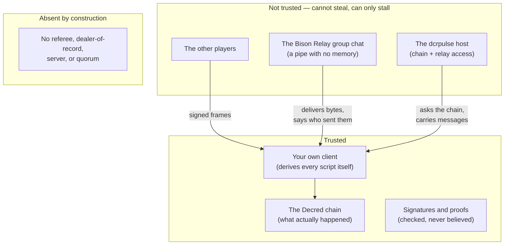
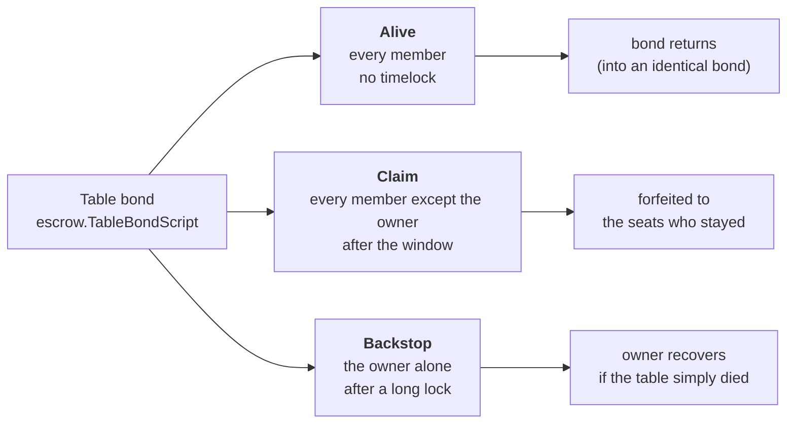
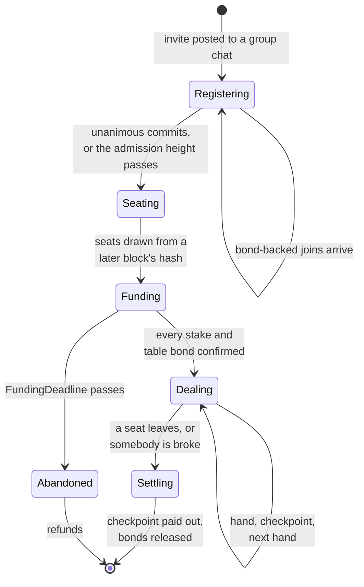

# Trust Model

What you have to trust to sit at one of these tables, what you do not, and where
the gaps still are.

Two rules for reading it. **The code is authoritative** — where this document and
the code disagree, the code is right and this is stale; the reasoning behind each
decision lives in the package comments and commit messages, which are long on
purpose. And **the numbers are named, not written out**: constants are referred to
by name (`escrow.MinBondBlocks`, `schema.Version`) because a document that repeats
a number is a document that will contradict the code within a month.

Scope: the peer-to-peer design, which is what this project is. A separate
client/server path still exists in the tree and is on its way out; it is described
last, and nothing else here concerns it.

---

## 1. The trust boundary

A player trusts their own machine, the Decred chain, and arithmetic. That is the
whole list.



Three things follow, and they are the design in one breath each.

**Nobody can move your coin.** Every escrow's spending branch needs a signature
from every seat at the table; the only unilateral branch is your own refund, after
a timelock. There is no key anywhere that spends another player's stake.

**Nobody can read a card they are not entitled to.** The deck is masked to a joint
key that is the sum of every seat's, so opening any card needs a share from every
seat. No threshold, no t-of-n, nothing special about the board.

**Nobody can rewrite what happened.** Every action is signed by the seat that took
it and hash-chained, and the nonce is derived from the *position* rather than the
message — so signing two different things at one position publishes the signing
key. Equivocation is not reported and adjudicated; it hands the cheat's key to
whoever it lied to.

What the untrusted parties *can* do is stop. A peer that goes silent, or a group
chat that drops a message, can stall a table. That is the residual failure mode
throughout, and sections 5 and 6 are about paying for it rather than pretending it
away.

---

## 2. The money

Three instruments, each answering a different question. They are separate because
the times at which they can exist are different, and nothing dissolves that: see
the two bonds below.

| | what it is | who can spend it | when |
|---|---|---|---|
| **Stake** | the buy-in, in a per-seat n-of-n escrow | all seats together, or you alone after CSV | the hand |
| **Registration bond** | your own coin, timelocked | you, and only you, ever | `escrow.MinBondBlocks` |
| **Table bond** | forfeitable to the seats who stayed | see the branches below | `escrow.TableBondBlocks` |

### The stake escrow

Two branches. Settlement takes one `OP_CHECKSIGALTVERIFY` per member in canonical
key order, schnorr-secp256k1; refund is `csvBlocks OP_CHECKSEQUENCEVERIFY OP_DROP`
and then the depositor's own key, alone.

That asymmetry is deliberate and load-bearing: recovering *your own* funds must
never depend on anyone else's cooperation, and spending the pot must always depend
on everyone's. It is a chain of checks rather than a multisig opcode because the
escrow has to be Schnorr — Decred has `OP_CHECKMULTISIG` but no
`OP_CHECKMULTISIGALT`, and dcrd's secp256k1 ships no MuSig2 to aggregate with.

`pkg/escrow` is the only definition of these scripts. Every peer derives every
other peer's deposit address itself, from the roster it already agreed, so nobody
is ever *handed* an address. The check is not passed, it is removed — along with
the party that could have got it wrong. What replaces it is the requirement that
two implementations produce byte-identical scripts, since a one-byte disagreement
sends money where nobody can reach it.

One detail that is easy to get wrong and fails silently: **a signature is 65 bytes
on the wire**, not 64 — schnorr's 64 plus a sighash-type byte (`escrow.SigLen`).
Anything counting signatures in these sigScripts, including a co-signing host that
only relays them, must agree on that number, or it refuses every settlement this
design produces and cannot say why.

### The bonds, and why there are two

A forfeitable bond has to name the people it would be forfeited to. At
registration there is no roster to name — that is the whole reason funding is
roster-first — and the only party known that early would be a referee, which is
exactly the custody this design removes. **Forfeiture and registration time are
mutually exclusive**, so there are two instruments.

The registration bond is a Sybil cost and nothing else: your own coin, locked,
spendable by nobody, ever. It buys the cost of a fresh identity (keys are free;
a week of locked coin is not) and a standing deterrent against
register-and-vanish. It must be **proved held, not merely cited** — `pkg/escrow/pop.go`
has the holder sign a digest binding the outpoint to the key that will sit at the
table, and `VerifyBondPoP` takes the owner key from the *script* rather than from
the claimant, so a proof cannot be lifted from someone who published one.

The table bond is the one with teeth, posted after the roster closes and
derived from the settled seating:



**An answer beats a claim because it carries no timelock.** That is the whole
mechanism: the accused does not have to be believed, or heard, or fast — they only
have to still be there, and being there is cheaper than the claim is.

The trap in that shape: the alive branch needs the *accusers'* signatures, and they
will not sign once they have started claiming. So an answer assembled at the time
cannot exist. It has to be agreed in advance and kept by its
owner, and it pays the bond back into an identical bond so holding one early is
worth nothing. A chain of them is pre-agreed at once, which Decred permits because
a transaction's identity is its prefix and signatures live in the witness — so
every outpoint in the chain is known before anything is signed.

### Settlement

There are no adaptor branches per possible winner. Every seat signs a
**checkpoint** — the stacks at a hand boundary — and settlement pays that out
directly: one input per seat behind its own script, one output per seat, every
member's signature on every input.

Split pots, multiple winners and side pots are then just numbers in a checkpoint,
so nothing blows up combinatorially. What makes that work is **not trying to settle
a hand**. A hand in progress was never agreed by anybody, so a table that stops
settles at its last boundary and voids what was under way. This is also why
nothing has to establish who stopped the table, and why there is nothing to
broadcast mid-hand that whoever is losing could abuse.

---

## 3. The table's life



**Formation has no proposer.** Every peer computes the roster itself; nobody closes
the table. Two properties make that safe, and the first rules out the obvious
approach:

- **Exact fill, not "the lowest N keys."** Healing only ever grows a peer's set of
  joins, but "lowest N of S" is not monotone in S — one low key arriving late
  ejects the previous highest member, so one peer can settle while another, holding
  one more join, computes something different. Under exact fill a peer holding a
  strict subset computes *no* candidate and stays quiet, which makes being
  under-informed self-evident rather than indistinguishable from being
  well-informed.
- **Binding is on an irrevocable `commit`, not on a claim.** The healing message
  is revisable and nobody acts on it. Committing happens once per session, ever,
  so two honest peers that both settle either settle the same roster or share no
  member — a shared member would have had to commit twice, which is a
  self-contained proof of the kind `gamelog.EquivocationProof` already handles.

The commitment covers the **terms**, not just the keys. An invite is ordinary chat
text, so whoever forwards it could otherwise hand one player one buy-in and
another a different one — and winner-take-all only divides a pot fairly across
equal stakes. `csvBlocks` is in there too, because each member builds their own
refund branch and a member whose branch matured in one block could pull their
stake mid-hand.

**Seats are drawn from a block hash**, not from key order, and the block must not
exist yet while anybody is still choosing a key. Seat 0 carries the first button,
so key order would have let a member grind for position.

**Deadlines are heights, never clocks.** The admission window, the funding
deadline, the dispute window — all of them. A clock is one machine's opinion, and
money moving on an opinion is money moving on whoever's clock runs fast.

---

## 4. The deck

ElGamal masking with Neff verifiable shuffles, on kyber's edwards25519
(`pkg/deck`). The joint key is the **sum** of every seat's per-hand card key, so
every card is masked to all of them at once.


A fresh card key every hand, because a key is worthless once its hand is over but
would make the *next* hand readable to anyone who kept it.

The starting deck is masked with **zero randomness**, deliberately, so every peer
recomputes the same one — the first shuffler's blinding is what provides secrecy.
This has a consequence that matters in section 8: the card at each initial slot is
public.

### The dependency is not trusted

kyber's `proof/dleq` is **unsound**. `Verify` checks `VG == rG + c·xG` and
`VH == rH + c·xH` and never recomputes `c` from the transcript — and since `C`,
`R`, `VG` and `VH` are all attacker-supplied struct fields, you can pick `c` and
`r` freely and solve for the commitments. It is not weak Fiat–Shamir; the
transform simply is not performed. `pkg/deck/dleq_check_test.go` asserts the
forgery succeeds, so the test **passes while kyber is broken** and will fail the
day it is fixed. The working construction writes the statement as a `proof.Rep`
conjunction over a shared secret name and pushes it through `HashProve`, whose
verifier does re-derive the challenge.

Two habits came out of that and generalise:

- **Pin proof lengths by measuring them.** kyber's verifiers stop reading once
  satisfied and ignore trailing bytes, so a proof is malleable — harmless until
  you hash, sign, dedup or log the bytes, which this does. `proofLen`/`shareLen`
  measure the honest encoding once rather than hard-coding a constant, so a
  dependency bump cannot silently falsify them.
- **Try to forge against a primitive before trusting it.** Reading the library
  would not have found this. Attacking it did.

### Costs, measured

A masked deck is 3328 bytes, a shuffle proof 20064, a share 128; proving a shuffle
takes about 135 ms and verifying one about 204 ms. A hand costs roughly 49 KB at
two seats and 153 KB at six — but **each player sends about 25 KB regardless of
seat count**, one deck and one proof, so the transport needed nothing new.
Verification is what scales with the table.

---

## 5. The log, and why cheating is arithmetic

Poker is turn-based: at any moment exactly one seat may legally act, and which one
follows from a deterministic state machine. So a hash-chained log where each entry
carries `(prev_hash, seq, seat, action)` signed by the acting seat is linear by
construction — an entry from the wrong seat is simply invalid — and **no consensus
is required**.

The signature is not an ordinary one. The nonce is derived from the key and the
*position*, never from the message:

```
k = H(d ‖ match ‖ domain ‖ seq)        s = k − e·d
```

Sign two different messages at one position and `s₁ − s₂ = (e₂ − e₁)·d` hands over
`d`. Equivocation *is* signing twice at one position, so the cheat publishes its
own key; nobody votes, nobody is believed, and no script has to parse a log. The
bond's punishment branch pays to the sum of that key and one opponent's, so only
the party that was lied to can spend it — not any passing observer.

**`Domain` is the part that is easy to leave out and mandatory.** A seat
legitimately signs a log entry at sequence 5 *and* a head attestation at sequence
5; without separation it would leak its own key by behaving perfectly. Every kind
of signed message needs its own domain, and adding one is part of adding a message
type.

A repeat is free and must be. The repair discipline in section 6 re-sends
anything that has to arrive, and because the nonce comes from the position rather
than the message, re-sending an identical frame produces a **byte-identical**
signature. Honest retransmission can never look like equivocation.

### Faults: attributable and subjective

These must never be mixed.

**Attributable** — equivocation, an invalid signature, an illegal action. The
proof is a self-contained pair of signed messages, checkable offline by anyone,
needing no quorum.

**Subjective** — silence. In an asynchronous network silence is indistinguishable
from a partition, and Bison Relay offers no delivery proof, so "they did not
answer" is unfalsifiable in *both* directions. A quorum-signed timeout records a
belief, not a fact, and would let any N−1 players frame the Nth.

Only attributable faults may affect funds. Abandonment is therefore closed
**without attributing it at all**:

```mermaid
sequenceDiagram
    participant P as A peer
    participant Chain as The chain
    participant Q as The seat it is waiting on
    Note over P: the log says seat Q owes the entry at seq 9
    P->>P: wait the window, then wait it again
    P->>Chain: broadcast a claim on Q's table bond
    Q->>Chain: spend the same output — the answer, no timelock
    Note over Chain: the answer confirms first, being untimelocked
    Note over P,Q: nobody adjudicated; presence decided it
```

A claim names an **obligation the log says a seat owes**, which every peer derives
identically — not a person, and not an accusation. What decides it is a race, not
a judgement. Silence convicts nobody who is present.

One property there is load-bearing: **a seat that owes nothing cannot be claimed
against at all.** Without it, a player who *stalls* could wait for their opponent
to give up and then claim the bond of the person who stopped playing because of
them — and heads-up there is no third party to refuse.

---

## 6. Liveness, and the one rule that keeps being relearned

The group chat loses messages. A lost message that somebody is waiting on
deadlocks a hand outright: the sender believes it has done its part, the receiver
believes it is still waiting, and neither has anything to log.

> **Anything that must arrive is repeated on a clock and stopped by a deadline —
> never by our own view looking settled.**

It is easy to violate while appearing to obey, and one shape does it every time:
bounding a repeat by a fingerprint of our own progress — *if nothing has moved, we
already said it*. If the repeat is **itself** lost, nothing moves, precisely
because the peer never got it, so the one message that would unstick the table is
the one message the rule forbids.

A second shape, same instinct: **note a duty as done only once it is actually
discharged.** A share noted before it is verified leaves the duty gone and the work
outstanding, and the deduplication then eats the good copy when it arrives.

Repeats are paced in blocks where the thing being waited on is on-chain
(`stallEvery`) and in wall-clock where it is not (`dealStallEvery`), with the
clock injectable so tests can spend time without spending time. And what is
re-sent is scoped to what still matters — republishing a finished hand's deck
traffic into a new hand caused a shuffle to be rejected as out-of-turn, which
looked exactly like a peer misbehaving.

---

## 7. The wire

Traffic rides Bison Relay as an envelope over ordinary messages:

```
--gaming[v=1,game=poker,gv=2,sid=<hex>,mid=<hex>,seq=<n>/<total>,exp=<unix>]--<base64>
```

`v` versions the framing and `gv` the game, separately, so a breaking change to
poker cannot invalidate another game's traffic. `game` is a routing key: a client
receiving a game it does not implement must ignore the part and must **not**
surface it as chat, which is what makes the namespace forward-compatible. `sid`
distinguishes concurrent tables and is bound to the match id, aligning wire
routing with the on-chain escrow binding.

Matching is anchored over the whole body and the payload must actually
base64-decode — shape alone is not enough, since prose can be frame-shaped and a
human who mentions `--gaming[` must not have their message silently swallowed.

### What a group chat is, and is not

Three properties of Bison Relay group chats account for most of the design above:

- **A member can equivocate and BR will never notice.** A group message is fanned
  out as N separate ratcheted one-to-one messages. There is no relay point and no
  shared transcript — a group exists only as N independent local copies, and
  nothing compares them. Each message *is* individually signed, so two conflicting
  ones are directly comparable: equivocation is provable after the fact, never
  prevented. That is what the signed chain and head attestations are for.
- **There is no ordering.** No sequence number in the group message; reassembly
  is best-effort by a sender-supplied, unsigned timestamp. All sequencing comes
  from the payload.
- **The group roster is not the table roster.** Different members can hold
  different member lists at the same generation, and merely receiving a message
  can mutate the local list. **Authority stays with the escrow roster committed
  on-chain. The group is a pipe.**

### Identity, and where it has to be consulted

The sender's uid is authenticated by the transport and no payload field can forge
one. That is a property of the transport, and it buys the game nothing at any point
where the game does not consult it — which is the trap, because the seat is also
named in the payload, and payload and transport can disagree.

So nothing on the deal path decides anything from the transport. Every frame that
carries the dealing — card key, shuffle, leaving — is signed by the seat it names
and checked against the roster the escrow committed to. A Neff proof cannot stand
in for that: its witness is the permutation and the masking rather than a key, so
anybody can produce a valid shuffle proof under anybody's card key. A card key
needs it most, since the joint key is the sum of all of them and a key accepted for
the wrong seat masks every card to a secret that seat does not hold.

Each is signed at its own `forfeit.Domain` indexed by hand, because a seat does
each exactly once in a hand — so equivocating on one publishes the key, exactly as
it does for a log entry.

**Requiring them is a wire break, and there is deliberately no mode that accepts
unsigned frames**, because such a mode is the hole itself held open by a flag
somebody forgets. Peers on different `schema.Version`s do not play together.

The rule worth carrying elsewhere: **an authenticated value is worth nothing at the
point where the code stops consulting it.**

### Integration requirements for the host

- Envelopes must be suppressed from notifications so they neither badge the UI nor
  unarchive contacts.
- **User content-filter rules must not be allowed to match protocol frames.** The
  highest-consequence detail in the whole integration. Filters run on the live
  receive path before notifications fire, so a user regex that swallows gaming
  frames drops a player mid-hand with funds escrowed — indistinguishable from
  abandonment. A PM-only guard is not enough: the game is in the *group* chat.
- Authorization must precede reassembly state. Frames are invisible to the user by
  design, so an unsolicited flood is a silent memory-exhaustion channel: allocate
  nothing for a peer who is not in a joined table or an accepted invite.
- Hidden from chat must not mean discarded. Dispute proofs are signed messages the
  client kept.
- `exp` needs message classes. Turn traffic should expire quickly so a stale raise
  cannot land after settlement, but dispute notices must live at least as long as
  the dispute window — otherwise store-and-forward can hold a notice while a
  player boots and have the receiver drop it as expired, silently disabling the
  honest player's escape hatch.

---

## 8. What is still open

Ordered by what would bite first.

- **The reveal-and-recompute audit is not wired to anything.** `pkg/deck/audit.go`
  exists and is tested; `deck.Audit` has no caller outside the package, the
  shuffle secret is discarded at the only `deck.Shuffle` call site, and there is
  no message kind to publish secrets in. It is the intended answer to an unsound
  dependency — a hand ends with every player publishing their secrets and every
  peer recomputing without consulting a single proof, so it holds *even if the
  proofs are wrong* — and it is currently a promise rather than a mechanism.

  It cannot simply be switched on either. **Publishing shuffle secrets publishes
  the muck, permanently.** The starting deck is masked with zero randomness (section
  4), so the card at each initial slot is public, so composing the published
  permutations maps public starting cards to final slots — with or without the
  card keys. Revealing every hand makes every folded hand public forever and
  folding ranges exact for anyone who greps their log. That is a different game
  and nobody chose it. The shape that keeps poker being poker is **audit on
  challenge**: honest play reveals nothing, any player may challenge a hand inside
  the dispute window, and refusing to reveal then is a forfeit. Detection becomes
  deterrence, which the bonds already make sound, and it fixes the incentive at
  the same time — a player already paid has no reason to publish unless declining
  costs them.

- **Stale checkpoints are not punishable.** A peer holds every checkpoint it ever
  signed and nothing stops it settling on an old one. Decrementing timelocks or
  Lightning-style revocation each close it; neither is built.

- **The table bond has no production reclaim path.** It can be posted and it can
  be forfeited, but the backstop branch has no caller, so a bond from a table that
  simply ended sits until somebody writes one.

- **Short-handed continuation.** A table dissolves when somebody leaves, because
  the escrow, the bond and the roster all name the full membership — continuing
  without a seat means re-forming all three, which is a new table with carried
  stacks rather than this one with a gap.

- **`MinBondAtoms` is a development value** and has to go back up before a bond
  deters anybody.

- **A wallet passphrase typed wrong permanently fails a spend.** Retrying works,
  but the spend should stay open the way an unreachable one does.

- **Little has met a real network.** Hands, settlements and cooperative bond
  releases run on mainnet between two machines. What has not been exercised: three
  or more seats, a KX reset opening a claim against a peer who did nothing wrong, a
  contested claim, or any hostile participant. The first is where the deck's
  liveness cost actually appears; the second is not a bug but the design working
  — a reset and an abandonment are deliberately indistinguishable, which is why
  the accused holds an answer in advance. **Exercise the answer path before the
  claim path.**

- **Some tests wait on the wall clock, and starve.** Repairs are paced in blocks
  where the thing being waited on is on-chain and in wall-clock where it is not
  (`dealStallEvery`), and the tests covering the second kind spend real time. Under
  a full parallel run on a busy machine a starved test can take sixty times its
  isolated duration and trip its own deadline — so the suite passes on most runs
  and not on all of them, and every package is clean when run alone. The legacy
  `e2e` suite has the same sensitivity in its own form, waiting on short
  `require.Eventually` deadlines under `t.Parallel()`.

  The fix is the one the rest of the harness already applies: spend injected time
  through the table's own clock, never the wall's. Until then **a green parallel run
  is weaker evidence than it looks**, and a failure in one of these is worth
  reproducing in isolation before believing it.

---

## 9. Rejected alternatives

Each of these is the obvious answer to a real problem, and each fails. They are
recorded because the reasoning is the most reusable part of the design, and because
anybody who has not seen the objection will propose them again.

**Threshold decryption of board cards.** The idea is to t-of-n only the board so a
leaver cannot freeze it. But `t = n−1` lets any n−1
players read the last one's hole cards, and heads-up `t = 1` means your opponent
reads your hand. It buys liveness by selling the one property the deck exists to
provide, and the liveness it buys had a cheaper answer.

**"Drop-out is harmless on its own."** True of settlement, since presigs for every
outcome are collected in advance, and false of everything else: a leaver freezes
the deck for everyone still playing, because every card needs their share, so at
three or more seats a hand cannot finish. Heads-up it genuinely is harmless, which
is a strong argument for heads-up first. The answer is economic rather than
cryptographic — the table bond, plus a **clean exit** so that leaving is an ordinary
thing a player may do: free between hands, a fold in the middle of one, which is
what stops leaving being a way to un-bet a hand that is going badly.

**A dispute window measured in minutes.** Sizing it to human and machine recovery —
about twice the time to boot a computer and start Bison Relay — is the intuitive
choice, and no such interval can be witnessed by anything both parties can check.
The window is block-granular, and a peer waits several times over before it will
even propose a claim, so the whole thing says "you are not coming back" rather than
"you are slow". Tempo is not enforced at all: it is a UI concern, and a table's
answer to somebody merely slow is to leave, which costs at most one folded hand.

**Reading "only attributable faults may affect funds" as "abandonment cannot be
punished".** The constraint is right and the conclusion does not follow. See the
claim race in section 5: nothing attributes abandonment, and a bond still moves.

**Commit-reveal deck seeding.** It stops deck *prediction* and not deck
*observation*, so it is strictly weaker than mental poker — worth skipping rather
than building and discarding.

**Adaptor signatures per possible winner.** Unnecessary once settlement pays a
checkpoint: the combinatorics disappear (section 2).

---

## 10. The old server path

`cmd/pokerd` and its gRPC services still exist in the tree and are **on their way
out**. Nothing in sections 1–9 is on their path: the peer-to-peer client
reaches the chain and Bison Relay through its host, and speaks to other players
over a group chat.

For as long as it is here: the server sees every hole card, runs the state machine,
decides the winner, and holds the adaptor secret. No player action is signed.
`pkg/server/actionlog.go` is knowingly incompatible with current clients — it
builds its chain from escrow session keys while clients sign with a separate
per-match log key, so every entry a real client sends is refused. Its own tests
pass because they use log keys in both roles, which is exactly what hid the
incompatibility.

That last sentence is the most portable thing in this document. **A test that
derives both sides of a check from the same source is testing the derivation, not
the agreement**, and green means only "consistent with itself" — which is the one
thing a distributed protocol may never assume. The same fault, in four other
disguises, hid every serious bug this project has had: a roster built from the
wrong key type, an answer branch that needed signatures its holder could not get,
a stand-in peer with no independent clock, and 681 tests that never once asked who
sent a frame.
